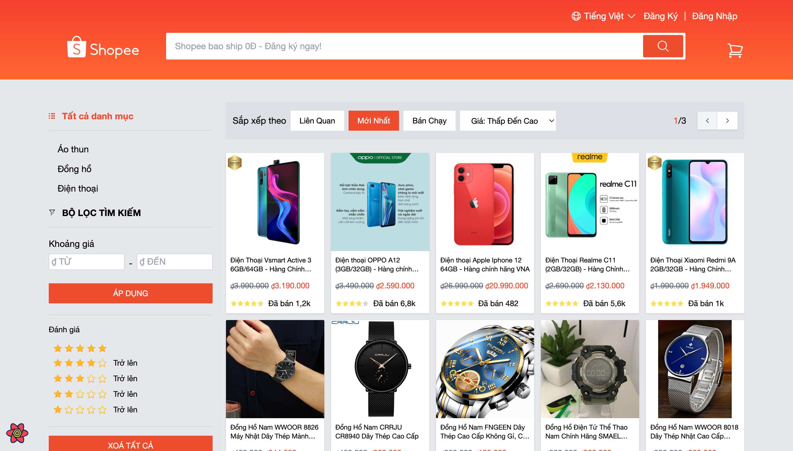
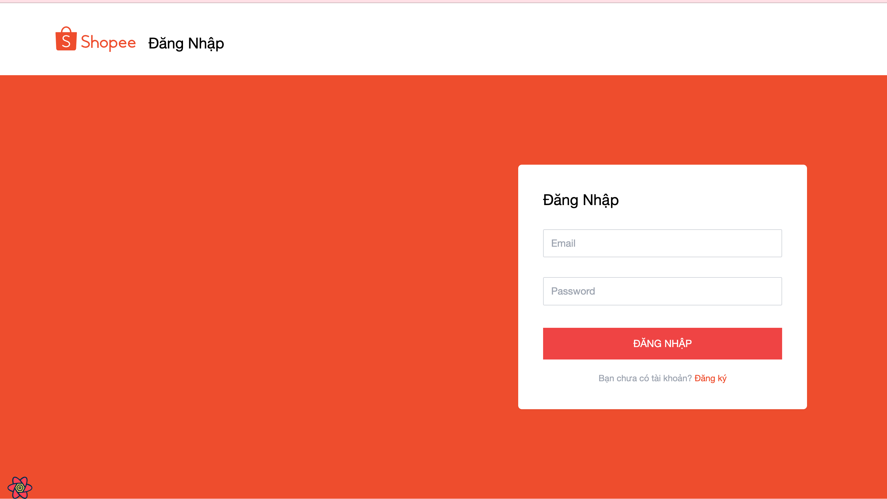
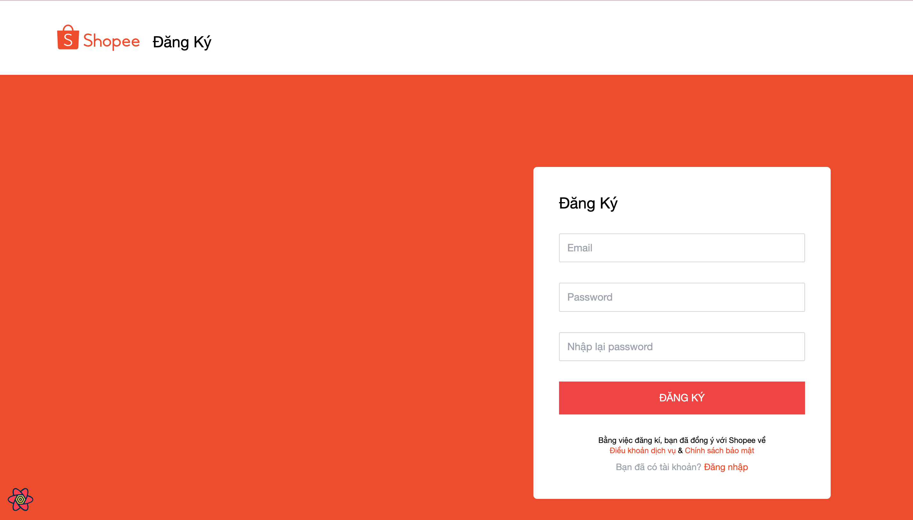

# 🛒 Shopee Clone Advanced

> Dự án clone nâng cao của trang thương mại điện tử Shopee với đầy đủ tính năng e-commerce, được xây dựng như một ứng dụng thực tế để thực hành và showcase các công nghệ web hiện đại.

## 🌐 Live Demo

**🚀 [Xem Demo Trực Tiếp](https://shopee-clone-opal-rho.vercel.app/)**

*Website đã được deploy trên Vercel với auto-deployment từ GitHub*

## 📸 Preview

### 🏠 Trang chủ - Homepage

*Giao diện trang chủ với danh sách sản phẩm, filter sidebar, và hệ thống phân trang*

### 🔐 Đăng nhập - Login  

*Trang đăng nhập với form validation và responsive design*

### 📝 Đăng ký - Register
  
*Trang đăng ký tài khoản với validation schema*

## 🚀 Tính năng chính

### 🛍️ Hệ thống sản phẩm
- **Danh sách sản phẩm**: Grid layout responsive với lazy loading
- **Tìm kiếm thông minh**: Debounced search với query highlighting
- **Lọc nâng cao**: Theo giá, rating, danh mục với URL persistence
- **Sắp xếp đa dạng**: Giá, độ phổ biến, đánh giá, ngày tạo
- **Phân trang**: Efficient pagination với query parameter management

### 🔍 Chi tiết sản phẩm
- **Gallery ảnh**: Image carousel với thumbnail navigation
- **Zoom effect**: Mouse hover zoom với natural scaling
- **Thông tin chi tiết**: Giá, đánh giá, mô tả với DOMPurify sanitization
- **Sản phẩm liên quan**: Recommendation system dựa trên category

### 🛒 Giỏ hàng & Đơn hàng
- **Add to Cart**: Thêm sản phẩm với quantity controller
- **Quản lý giỏ hàng**: Update, delete items với optimistic updates
- **Tính toán thông minh**: Real-time total với discounts và shipping
- **Checkout process**: Complete purchase workflow
- **Trạng thái đơn hàng**: Theo dõi từ pending đến delivered

### 👤 Hệ thống người dùng
- **Authentication**: JWT-based với auto token refresh
- **Profile management**: Cập nhật thông tin cá nhân
- **Protected routes**: Route guards với authentication checks
- **Session persistence**: Maintain login state across browser sessions

## 🛠️ Công nghệ sử dụng

### ⚛️ Frontend Core
- **React 18** - Modern React với Concurrent Features & Suspense
- **TypeScript** - Static typing cho enterprise-level code safety
- **Vite** - Lightning-fast build tool với HMR và optimized bundling
- **React Router v6** - Declarative routing với nested routes và loaders

### 📊 State Management & Data
- **TanStack Query v4** - Powerful server state management với caching strategies
- **React Context** - Global client state cho authentication và UI preferences  
- **Immer** - Immutable state updates với producer pattern
- **Lodash** - Utility library cho data manipulation và functional programming

### 🎨 UI & Styling
- **Tailwind CSS** - Utility-first framework với custom design system
- **Framer Motion** - Production-ready animations và micro-interactions
- **Floating UI** - Advanced positioning cho tooltips và dropdowns
- **ClassNames** - Conditional CSS classes với clean syntax

### 📋 Forms & Validation
- **React Hook Form** - High-performance forms với minimal re-renders
- **Yup Schema** - Declarative validation với TypeScript support
- **@hookform/resolvers** - Seamless integration với validation libraries

### 🌐 HTTP & API
- **Axios** - Promise-based HTTP client với interceptors
- **HTTP Status Codes** - Standardized response handling
- **RESTful API** - Clean architecture với proper HTTP methods
- **Request/Response Interceptors** - Auto token injection và error handling

### 🔧 Development Tools
- **ESLint** - Advanced linting với custom rules và auto-fix
- **Prettier** - Opinionated code formatting với Tailwind plugin
- **Vite Plugin React SWC** - Fast refresh với Rust-based SWC compiler
- **Rollup Plugin Visualizer** - Bundle analysis và optimization insights
- **Vitest** - Unit testing framework với Vite integration

### 🔒 Security & Utilities
- **DOMPurify** - XSS protection cho user-generated HTML content
- **JWT Authentication** - Secure token-based authentication system
- **LocalStorage Management** - Encrypted storage cho sensitive data

## 🏗️ Kiến trúc nâng cao

### 📁 Project Structure
```
src/
├── apis/              # 🌐 API layer với typed responses
│   ├── auth.api.ts    # Authentication endpoints
│   ├── product.api.ts # Product CRUD operations  
│   └── purchase.api.ts# Shopping cart & orders
├── components/        # 🧩 Reusable UI components
│   ├── Button/        # Custom button với variants
│   ├── Input/         # Form inputs với validation
│   ├── Pagination/    # Smart pagination component
│   └── QuantityController/ # Product quantity management
├── constants/         # 📋 App constants và configuration
├── contexts/          # 🔄 React Context providers
├── hooks/             # 🪝 Custom React hooks
├── layouts/           # 📐 Layout wrapper components
├── pages/             # 📄 Route-based page components
│   ├── ProductList/   # Homepage với filters
│   ├── ProductDetail/ # Product details với gallery
│   ├── Cart/          # Shopping cart management
│   └── Profile/       # User profile management
├── types/             # 📝 TypeScript definitions
└── utils/             # 🛠️ Utility functions
```

### ⚡ Performance Optimizations

#### 🎯 Query Strategies
- **Smart Caching**: Stale-while-revalidate với custom cache times
- **Query Key Hierarchy**: Efficient invalidation và data consistency
- **Background Refetching**: Keep data fresh without blocking UI
- **Optimistic Updates**: Immediate UI feedback với automatic rollback

#### 🚀 Code Optimization  
- **Route-based Code Splitting**: Lazy loading cho reduced initial bundle
- **Component Lazy Loading**: Dynamic imports cho heavy components
- **Bundle Analysis**: Rollup visualizer cho identifying optimization opportunities
- **Tree Shaking**: Dead code elimination với ES modules

#### 🖼️ Asset Optimization
- **Image Lazy Loading**: Intersection Observer API implementation
- **Responsive Images**: Multiple breakpoints với optimized sizes
- **Progressive Enhancement**: Graceful degradation cho slow connections

### 🛡️ Advanced Security

#### 🔐 Authentication Flow
```typescript
// JWT token lifecycle management
const authFlow = {
  login: () => storeTokens + setAuthContext,
  refresh: () => autoRefreshBeforeExpiry,
  logout: () => clearTokens + redirectToLogin,
  unauthorized: () => autoLogout + showLoginModal
}
```

#### 🛠️ Input Sanitization
```typescript
// Multi-layer protection
const securityLayers = {
  clientValidation: YupSchema,
  htmlSanitization: DOMPurify,
  xssProtection: CSPHeaders,
  apiValidation: ServerSideValidation
}
```

### 🎨 Advanced UI Patterns

#### 🛒 Shopping Cart System
```typescript
interface ExtendedPurchase extends Purchase {
  disabled: boolean    // Prevent multiple updates
  checked: boolean     // Bulk selection state
  loading?: boolean    // Individual item loading
}
```

#### 🖼️ Image Gallery với Zoom
```typescript
const ImageZoom = {
  mouseMove: calculateZoomPosition,
  mouseLeave: resetImageTransform,
  touchGestures: mobileZoomSupport,
  keyboardNav: accessibilitySupport
}
```

#### 📱 Responsive Design System
- **Mobile-first**: Progressive enhancement từ 320px
- **Breakpoint Strategy**: Tailwind's responsive utilities
- **Touch Optimization**: Gesture support và touch targets
- **Accessibility**: ARIA labels và keyboard navigation

## 🚀 Advanced Features Demo

### 🛍️ Smart Shopping Experience
- **Product Discovery**: Advanced filters với instant search results
- **Visual Feedback**: Loading skeletons và smooth transitions  
- **Error Recovery**: Retry mechanisms và offline support
- **Accessibility**: Screen reader support và keyboard shortcuts

### 📊 Data Management
- **Real-time Updates**: Optimistic UI với server synchronization
- **Cache Strategies**: Background refresh và stale data handling
- **Error Boundaries**: Graceful error handling với fallback UI
- **Performance Monitoring**: Query devtools và bundle analyzer

### 🎯 User Experience
- **Progressive Enhancement**: Works without JavaScript
- **Offline Support**: Service worker cache strategies
- **Performance Budget**: Bundle size monitoring và optimization
- **A11y Compliance**: WCAG guidelines implementation

---

*Dự án này showcase best practices trong việc xây dựng ứng dụng React enterprise-level với focus vào performance, security, và exceptional user experience.*